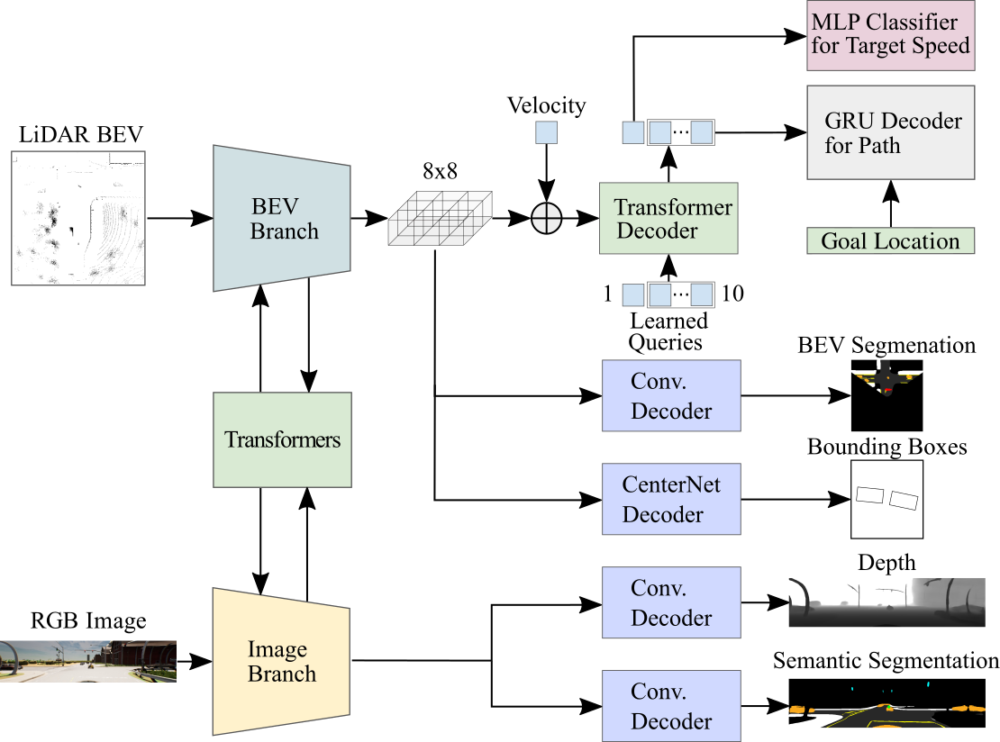

# CARLA Garage

[](https://huggingface.co/papers/2306.07957)

## [PDF](https://arxiv.org/pdf/2306.07957.pdf) | Video | Talk | Slides

<br/>

> This repo is intended to serve as a starting point for end-to-end autonomous driving research on [CARLA](https://github.com/carla-simulator/carla). We will provide a set of baselines and pre-trained models.

## To Do
- [ ] Dataset
- [ ] Documentation
- [x] Pre-trained models
- [x] Training code
- [x] Data collection code
- [x] Additional scripts
- [x] Inference code
- [x] Initial repo & paper


https://github.com/autonomousvision/carla_garage/assets/22528226/fb10cf21-5e70-4bb2-a917-893d71804350


<br/>

> [**Hidden Biases of End-to-End Driving Models**](https://arxiv.org/abs/2306.07957)
>
> [Bernhard Jaeger](https://kait0.github.io/), [Kashyap Chitta](https://kashyap7x.github.io/), and [Andreas Geiger](https://www.cvlibs.net/)
> 
> University of Tübingen, Tübingen AI Center
>


## News
* **`14 Jun, 2023`:** We released our paper on [arXiv](https://arxiv.org/abs/2306.07957). Code and models are coming soon, please stay tuned!


## Overview

- End-to-end driving systems have recently made rapid progress, in particular on CARLA.

- Independent of their major contribution, they introduce changes to minor system components. Consequently, the source of improvements is unclear.

- We identify two biases that recur in nearly all state-of-the-art methods and are critical for the observed progress on CARLA: (1) lateral recovery via a strong inductive bias towards target point following, and (2) longitudinal averaging of multimodal waypoint predictions for slowing down.

- We investigate the drawbacks of these biases and identify principled alternatives. By incorporating our insights, we develop TF++, a simple end-to-end method that ranks first on the Longest6 and LAV benchmarks, gaining 14 driving score over the best prior work on Longest6.


## Method

<div align="center">

</div>


## Results
Performance on training towns (Longest6, released models).

| **Method**                   | **DS ↑** | **RC ↑** | **IS ↑** | **Ped ↓** | **Veh ↓** | **Stat ↓** | **Red ↓** | **Dev ↓** | **TO ↓** | **Block ↓** |
|------------------------------|----------|----------|----------|----------|----------|-----------|----------|----------|---------|------------|
| [WOR](https://arxiv.org/abs/2105.00636)                      | 21       | 48       | 0.56     | 0.18     | 1.05     | 0.37      | 1.28     | 0.88     | 0.08    | 0.20       |
| [LAV v1](https://arxiv.org/abs/2203.11934)                   | 33       | 70       | 0.51     | 0.16     | 0.83     | 0.15      | 0.96     | 0.06     | 0.12    | 0.45       |
| [Interfuser](https://arxiv.org/abs/2207.14024)               | 47       | 74       | 0.63     | 0.06     | 1.14     | 0.11      | 0.24     | 0.00     | 0.52    | 0.06       |
| [TransFuser](https://arxiv.org/abs/2205.15997)               | 47       | 93       | 0.50     | 0.03     | 2.45     | 0.07      | 0.16     | 0.00     | 0.06    | 0.10       |
| [TCP](https://arxiv.org/abs/2206.08129)                     | 54       | 78       | 0.69     | 0.01     | 0.65     | 0.20      | 0.19     | 0.02     | 0.03    | 0.30       |
| [LAV v2](https://arxiv.org/abs/2203.11934)                   | 58       | 83       | 0.68     | 0.00     | 0.69     | 0.15      | 0.23     | 0.08     | 0.32    | 0.11       |
| [Perception PlanT](https://arxiv.org/abs/2210.14222)    | 58       | 88       | 0.65     | 0.07     | 0.97     | 0.11      | 0.09     | **0.00** | 0.13    | 0.13       |
| TF++ (ours)             | **72**   | **95**   | **0.74** | **0.00** | **0.59** | **0.01**  | **0.05** | **0.00** | **0.02**| **0.06**   |
| *Expert*                | *89*     | *97*     | *0.92*   | *0.00*   | *0.12*   | *0.00*    | *0.02*   | *0.00*   | *0.03*  | *0.06*     |

Performance on validation towns (LAV, reproduced models).

| **Method**       | **DS ↑**   | **RC ↑**   | **IS ↑**      | **Ped ↓**     | **Veh ↓**   | **Stat ↓**  | **Red ↓**   | **Stop ↓**  | **Dev ↓**   | **TO ↓**     | **Block ↓** |
|------------------|------------|------------|---------------|---------------|-------------|------------|------------|------------|-------------|-------------|-------------|
| [TransFuser](https://arxiv.org/abs/2205.15997) | 39    | 84    | 0.46  | **0.00**      | 0.74        | 1.04       | 0.20       | 1.07       | 0.00        | 0.23        | 0.21        |
| [TCP](https://arxiv.org/abs/2206.08129) | 58  | 85     | 0.67   | **0.00**      | **0.35**    | 0.16       | **0.01**    | 1.05       | 0.00        | 0.19        | 0.19        |
| TF++ (ours)      | **70** | **99** | **0.70**| 0.01          | 0.63        | **0.01**   | 0.04       | **0.26**    | **0.00**    | **0.05**    | **0.00**    |
| *Expert*         | *94*       | *95*       | *0.99*        | *0.00*        | *0.02*      | *0.00*     | *0.02*     | *0.00*     | *0.00*      | *0.00*      | *0.08*      |

## Pre-Trained Models
We provide a set of pretrained models [here](https://drive.google.com/file/d/1dDeeRrPL7UAqqHn4RMdg3DrvHSlNgzmE/view?usp=sharing).
These are the final model weights used in the paper, the folder indicates the benchmark.
For the training and validation towns, we provide 3 models which correspond to 3 different training seeds.

To evaluate a model you can use [leaderboard_evaluator_local.py](leaderboard/leaderboard/leaderboard_evaluator_local.py).

Set the `--agent-config` option to a folder containing a `config.pickle` and `model_0030.pth`. <br>
Set the `--agent_file` to [sensor_agent.py](team_code/sensor_agent.py). <br>
To evaluate set the environment variable `export BENCHMARK=lav` or `export BENCHMARK=longest6`. <br>
The `--routes` option should be set to [lav.xml](leaderboard/data/lav.xml) or [longest6.xml](leaderboard/data/longest6.xml). <br>
The `--scenarios ` option should be set to [eval_scenarios.json](leaderboard/data/scenarios/eval_scenarios.json) for both benchmarks.<br>
We will provide scripts for evaluation at a later point.

Models have inference options that can be set via environment variables.
For the longest6 model you need to set `export UNCERTAINTY_THRESHOLD=0.33`, for the LAV model `export STOP_CONTROL=1` and for the leaderboard model `export DIRECT=0`.
Other options are correctly set by default.

## Contact
If you have any questions or suggestions, please feel free to open an issue or contact us (bernhard.jaeger@uni-tuebingen.de).


## Citation
If you find CARLA garage useful, please consider giving us a star &#127775; and citing our paper with the following BibTeX entry.

```BibTeX
@article{Jaeger2023ARXIV,
  title={Hidden Biases of End-to-End Driving Models},
  author={Jaeger, Bernhard and Chitta, Kashyap and Geiger, Andreas},
  journal={arXiv},
  volume={2306.07957},
  year={2023}
}
```


## Acknowledgements
CARLA garage includes code from the following projects:
* [simple_bev](https://github.com/aharley/simple_bev)
* [transfuser](https://github.com/autonomousvision/transfuser)
* [interfuser](https://github.com/opendilab/InterFuser)
* [mmdet](https://github.com/open-mmlab/mmdetection)
* [roach](https://github.com/zhejz/carla-roach/)
* [plant](https://github.com/autonomousvision/plant)
* [king](https://github.com/autonomousvision/king)
* [wor](https://github.com/dotchen/WorldOnRails)
* [tcp](https://github.com/OpenDriveLab/TCP)
* [lbc](https://github.com/dotchen/LearningByCheating)

Thanks to the community for these great open-source contributions!
